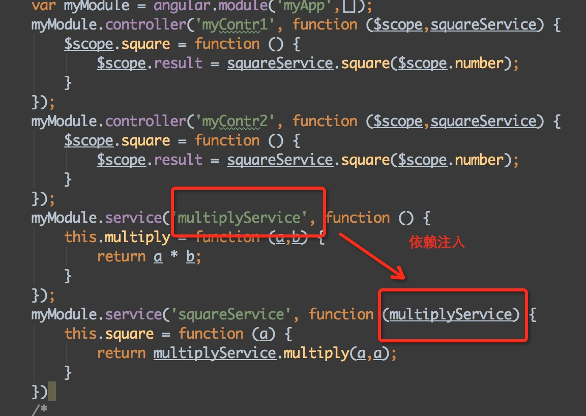
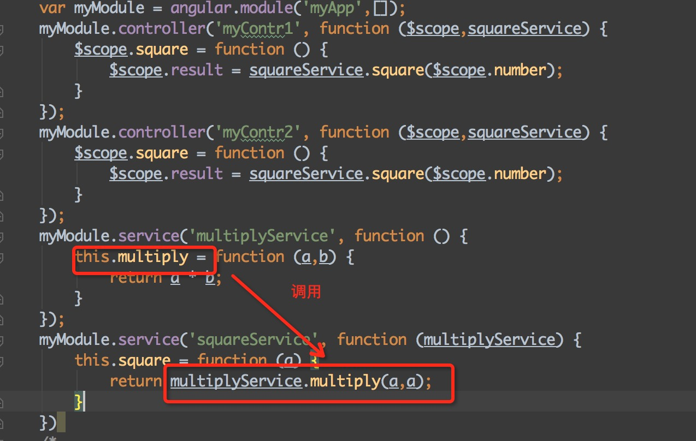
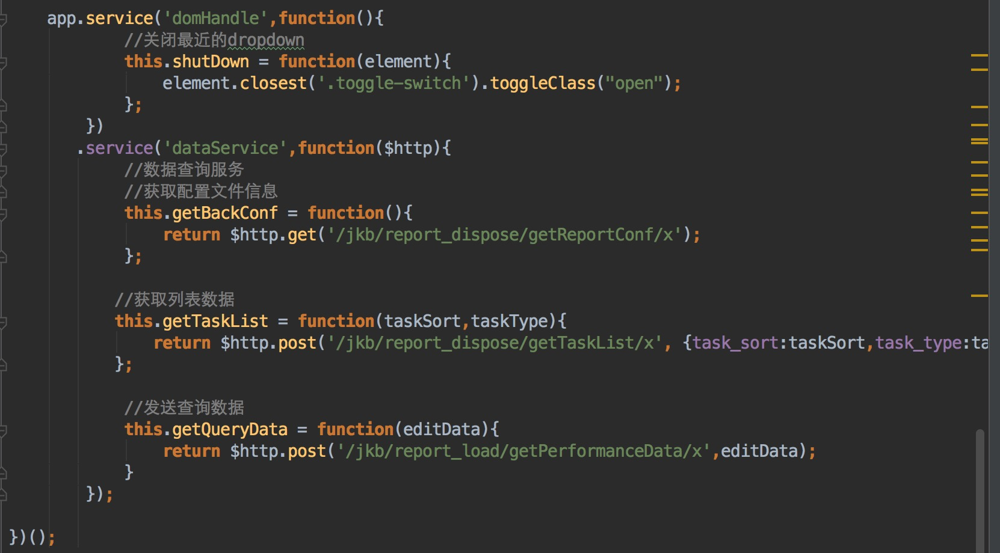

angular 服务

用途：其实就是提供一种方式抽取共用属性，方法；它可以让很多controller和directive访问内部的数值；

- 内置服务：
$开头   $http,$location,$q,$timeout.......
- 自定义服务：常用providers，factory，service，区别没有细看。(factory基本和service通用)

目前只用了service方式来创建服务

写法

模块名.service('customService',function(){})

举个例子：

    <!DOCTYPE html>
    <html lang="en">
    <head>
        <meta charset="UTF-8">
        <title></title>
        
    </head>
    <body ng-app="myApp">
    

        <input type="text" ng-model="number"/>
        <button ng-click="square()">求平方</button>
        result:{{result}}
    

    

        <input type="text" ng-model="number"/>
        <button ng-click="square()">求平方</button>
        result:{{result}}
    

    
    </body>
    </html>

解释说明：

- squareService服务调用了multiplyService服务里的方法，使用依赖注入，然后调用：服务名.方法()【multiplyService.multiply(a,a)】

  

  
- controller和directive里调用服务的方法也是一样的
- mycontr1和mycontr2控制两个不同的作用域，所以更改上面的input值不会影响下面的，但是服务可以公用的

监控宝中用到服务的地方：
  
